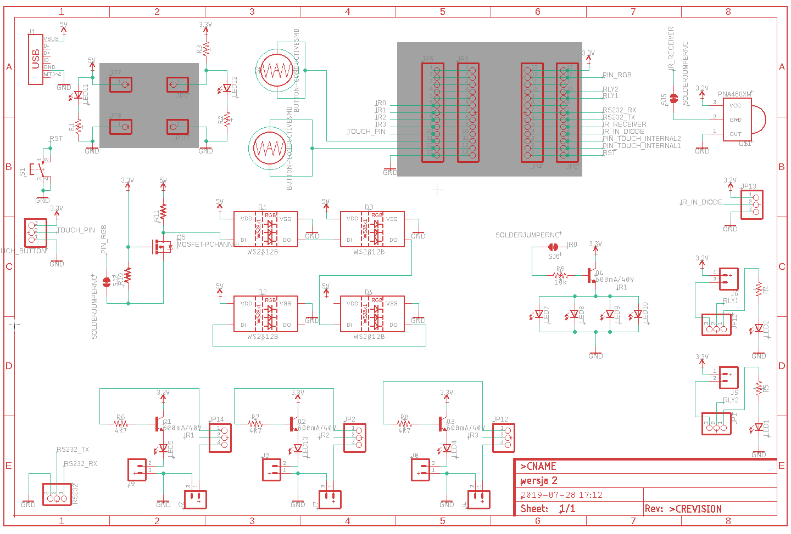

# Appliance connector

## Initial idea - visible gap on the market

The history behing this device came from my experience - I used to install smart home systems and saw some market gap in integrating smart home devices which oryginally was not intended to be "smart". I have in mind devices controlled over infrared, like air condationers, TVs, home theaters, audio systems, satellite and cable boxes, projectors, controlled over serial port (RS-232), like projectors, some audio entertainment systems, video conferencing systems, surveillance camera systems, etc., finishing on most simple, controlled with dry contact, like garage and gate openers, access control systems or blinds and curtains systesm, to just name a few. Backbone of most smart home systems in the end, almost always is TCP/IP network. Proabably the most universal method between both vendor locked and open smart home systems is communication via REST API. This device main prupose was to cover this gap, allow integration of all listed devices in thoughtfully manner. 

## Similar devices

Back in 2019, when we were working on this device, already some alternatives existed. There were deivces, which adresses only part of the problem. To list a few:

### Global Cache iTach

- **Pros**: Supports various connection options, compact, compatible with many systems.
- **Cons**: Setup complexity, may not suit simple needs, separate devices for RS232 and IR, high price

### BroadLink RM Pro+

- **Pros**: Affordable, supports IR and RF 433MHz, works with major voice assistants.
- **Cons**: RF control issues reported, app usability, lack of REST API.

### Remotec AC Master ZXT-600

- **Pros**: Specialized for AC control, supports major brands, energy-efficient.
- **Cons**: Limited to AC, setup complexity with certain hubs, lack of REST API.

### Blastbot IR Blaster

- **Pros**: Smartphone and voice control, supports schedules.
- **Cons**: Cloud dependency, IR only, lack of REST API.

### Remotec ZXT-310US

- **Pros**: Z-Wave to IR for AV devices, supports learning IR codes.
- **Cons**: Focus on AV, manual configuration for uncommon devices, lack of REST API.

### Hank IR Transceiver

- **Pros**: Z-Wave Plus, IR learning, compact.
- **Cons**: AV control focus, setup technicality, lack of REST API.

### Xiaomi Universal IR Remote Controller

- **Pros**: Very affordable, wide device support, integrates with Mi Home.
- **Cons**: Wi-Fi dependency, app/setup challenges for non-Chinese speakers, lack of REST API.

### Logitech Harmony

- **Pros**: Broad device compatibility, advanced automation, supports multiple connection types.
- **Cons**: Higher cost, discontinued models may affect support, lack of REST API.

## First prototype

First prototype was rough. Designed in `Autodesk Eagle` (shortly after buying it from CadSoft). It only purpose was to get rid off breadboards, which often cause more problems than circuit itself. This devkit was an extension to `Lolin32 Lite` prototyping board. This board I would call as "it ain't much, but it honest work" and most important allowed us quick start working on the software.

It has necessary components for testing initially agreed functionalities:
- IR leds for controlling devices
- IR receiver `PNA460XM`
- two experimental touch buttons (ESP32 has itself option for capacitive buttons support, but in the end we were unable to figure out how to make it work)
- connector for `TTTP223` based touch button module
- `WS2812B` Leds for showing status of the device
  

## Functional requirements and UI design

At this point we more or less know how device should function, which features implement. Form of the device was not clear yet, but anyway it didn't stop us from working on software. Basic user interface was designed in `Affinity Designer`. Simple mockup of the software, not functional, but give us good base for creating user interface in web technologies.

## Software Development

The web server runs directly on the ESP32, necessitating that the webpage be as simple and lightweight as possible. With only 4MB of storage available, every kilobyte counted. Most images used were .svg, and wherever feasible, they were generated using CSS to save space.

The ESP32 operates on `ESP-IDF FreeRTOS`. Developing such an advanced application in plain C—especially incorporating functions like Wi-Fi connection, filesystem management, and web server functionalities—would significantly increase the app's complexity.

### Frontend

Given the storage limitations, the frontend was designed to be straightforward and lightweight. This is why we opted not to use any frameworks for creating the GUI. It was crafted using simple HTML, with CSS for styling and JavaScript for websockets to minimize overhead and ensure efficiency.

https://github.com/lukasznowarkiewicz/ApplianceConnector/assets/82212257/3271daf3-c359-4126-b65f-c0a6bbfbe71e

### Backend

The backend of this application on the ESP32, utilizing ESP-IDF FreeRTOS, comprises various components, each managed by specific files:

- **Webserver**: `webserver.c` and `webserver.h` handle HTTP requests, serving the GUI files and processing API calls from the frontend. `webserver_types.h` likely defines the structures and enums used by the webserver.

- **Wi-Fi Connection**: `netConf.c` and `netConf.h` are responsible for configuring the Wi-Fi connection, handling tasks such as connecting to the Wi-Fi network and managing network settings.

- **Infrared Control**:
  - Sending IR commands: `irsend.c` and `irsend.h` manage the sending of IR commands to devices.
  - Receiving IR commands: `irrecv.c` and `irrecv.h` handle the reception of IR signals from remote controls.

- **UART Communication**: `tcpserial.c` and `tcpserial.h` handle of UART communication.

- **LED Control**: `led.c` and `led.h` are used for controlling LED indicators on the ESP32, such as showing the status of the device or Wi-Fi connection.

- **Relay Control**: `relay.c` and `relay.h` manage the activation and deactivation of relays for controlling dry contacts.

- **Button Input**: `button.c` and `button.h` handle input from physical buttons on the ESP32 device, allowing for user interaction without the web interface.

### Testing infrared

Testing receiving commands from IR:

https://github.com/lukasznowarkiewicz/ApplianceConnector/assets/82212257/00d33be0-9f63-4c23-b90f-50ff3d0fc727

Testing sending commands over IR:

https://github.com/lukasznowarkiewicz/ApplianceConnector/assets/82212257/5f554944-b339-42f7-858e-584611f51841

Saving received commands to text file (as a config):

https://github.com/lukasznowarkiewicz/ApplianceConnector/assets/82212257/204f5668-1959-4dcd-b433-fa26de5b123a

### Testing UART

https://github.com/lukasznowarkiewicz/ApplianceConnector/assets/82212257/dbb3c007-76f6-457e-a3c8-33a27682dad4

### Testing relays

https://github.com/lukasznowarkiewicz/ApplianceConnector/assets/82212257/7d674879-574c-41a6-804a-36f65532bcf2

## Enclosure

After we made first functioning prorotype - it was time to pack this device into sleek housing. 

## Hardware

## 
